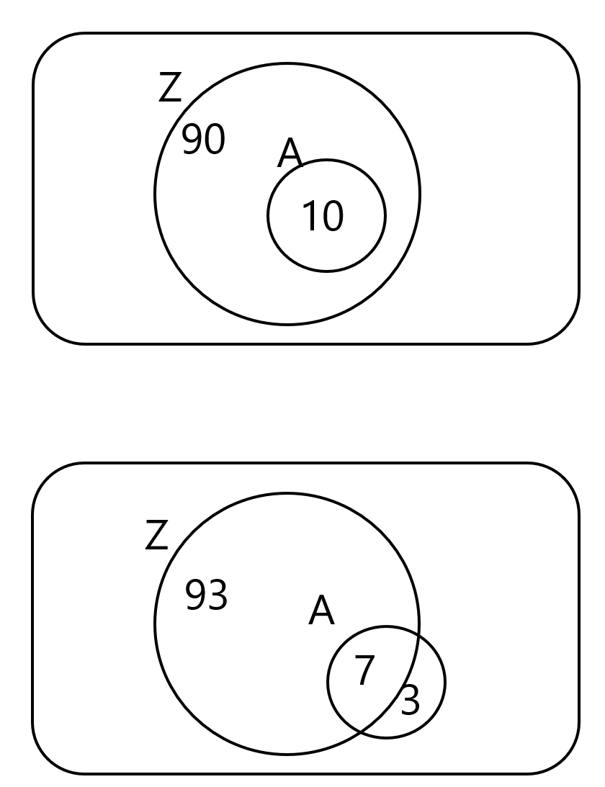
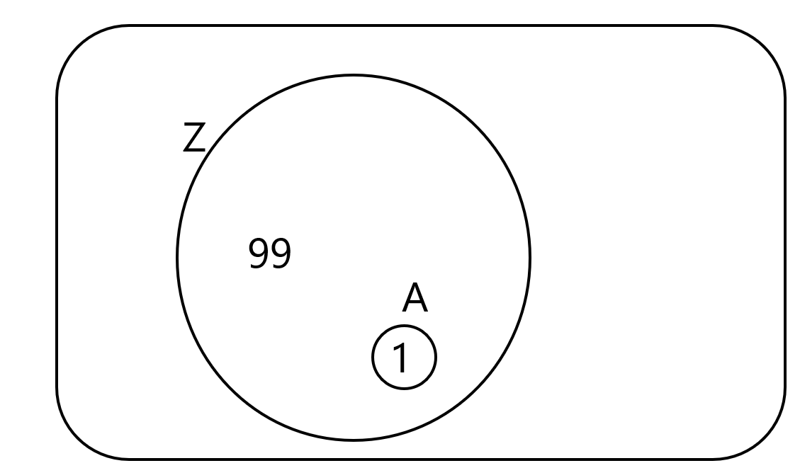
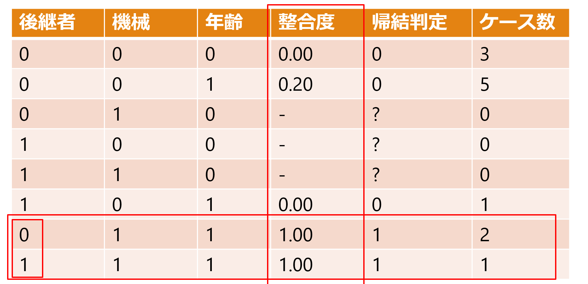
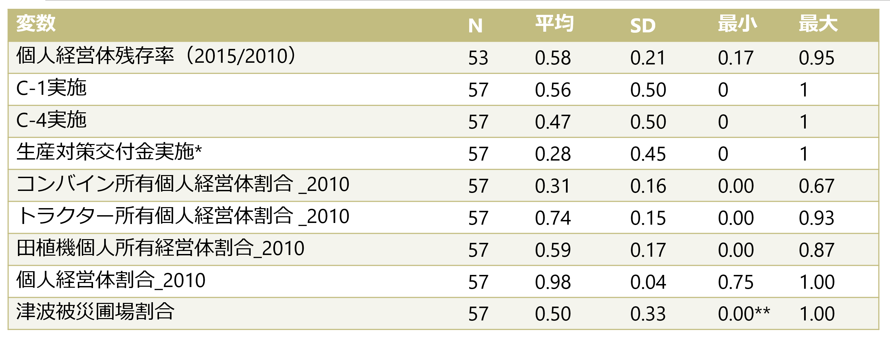
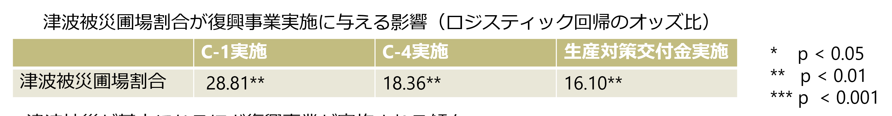
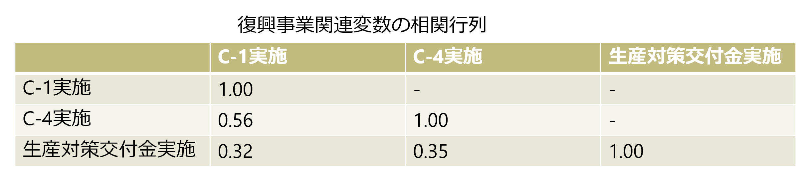
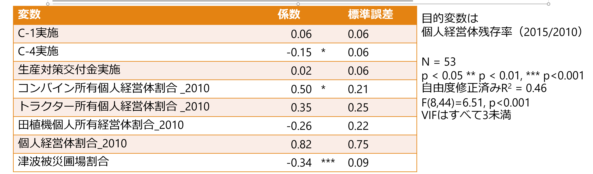
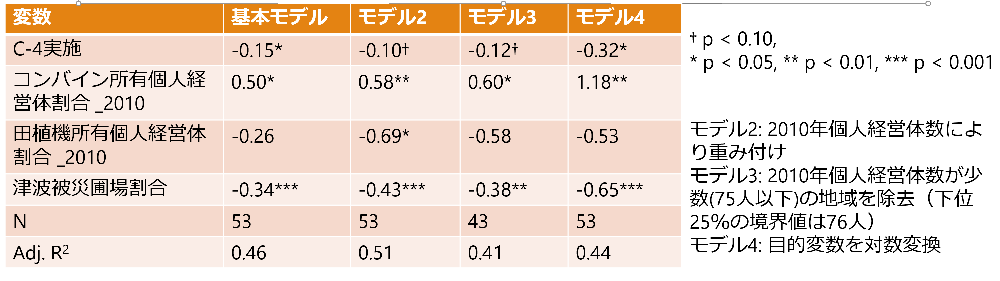
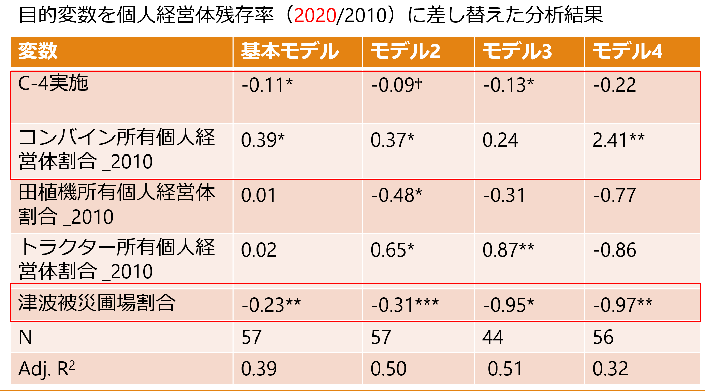

::: {.content-hidden when-format="html"}
# source
:::

```{r}
#| echo: false
#| output: false
# 被災のあった旧市区町村のデータだけを分析に使う
source("preparation.R")
df2 <- df |> filter(old_municipality == "1" & !is.na(tsunami_farmland_share))
```

# はじめに

## 津波被災を起点とする農業構造の経路分岐の可能性

- 津波被災は、その後の地域農業の構造変化を方向づけた可能性
- 津波被災地では、このような経路分岐がさまざまな形で生じているのではないか？

```{r}
df2 <- df2 |>
  mutate(
    share_over_20ha = entities_over_20_0ha / entities_total
  )

ggplot(
  df2,
  aes(
    x = tsunami_farmland_share,
    y = share_over_20ha
  )
) +
  geom_point() +
  geom_smooth(
    method = "lm",
    se = FALSE
  ) +
  facet_wrap(~ census_year) +
  labs(
    x = "津波被災農地割合",
    y = "20ha以上経営体割合"
  ) +
  theme_minimal()
```

宮城県沿岸部旧市区町村における津波被災農地割合と20ha以上経営体割合の関係（報告者作成）

## 経営体の異質性と地域農業構造

- 各経営体の異質性により、津波被災や政策に対する反応に多様性が生じる可能性 ミクロレベルの反応のちがい　→　累積　→　マクロレベルの地域農業構造の差異？

- こうしたミクロ-マクロ連関を正面から扱う研究は少ない

  - 震災復興研究では、小野（2019）がセンサスデータを用いて被災農業の構造変化を明らかにしているが、経営体の具体的な意思決定プロセスと関連づけてはいない

  - 経営体の異質性による政策効果のちがいを明らかにする研究は、海外では一定の研究蓄積があり（DeBoe2020）、国内でも一定数みられるが（日田ら2024など） 、地域農業構造の変化にまでつなげる議論は限定的

  - Saint-Cyr(2022)は、経営規模変化と補助金との関係が農家タイプによって異なることを示すとともに、その影響を経営規模階層別の農家構成変化として集計しているが、異質性は統計モデル上の潜在タイプとして推定されている　→　異質性を直接観察していない

  - ABMを用いた研究ではミクロ-マクロ連関を扱うものがみられるが、実証データをベースに行動ルールを設定した研究は少ない（Huber et al. 2026）

## 本研究の目的

- 宮城県S町を事例に、復興政策に対して各農業経営体が異なる反応を示した要因を明らかにするとともに、こうしたメカニズムと整合的な農業構造の変化が他地域にもみられることをセンサス等のデータを用いて明らかにする

# 宮城県S町営農組織における個人志向と組織志向の混在

## 宮城県における津波被災と農業復興政策

- 宮城県の耕地は津波被災の影響がもっとも大きい（小野2019）

  - 沿岸市区町村に限定すると、宮城県平坦部は42.1%の耕地が津波被災（宮城県中山間は28.3%）

  - 岩手県は4.6%、福島県は18.5%

- 宮城県における農業復興政策では、単なる原形復旧に留まらず、効率的な土地利用や経営体の競争力向上が目指されていた（宮城県（2011 ）

- 農業関連の復興交付金は、宮城県への配分額が大きい 農林水産省基幹事業関連の配分額合計は、宮城県3,392億円、岩手県1329億円、福島県701億円（東北農政局（2021））

## 農業復興関連の交付金

- 生産対策交付金

  - 推進事業と、生産関連施設の整備のための整備事業に分かれており、推進事業では機械リース、資材の共同調達、GAPの導入などが挙げられる

- 復興交付金事業

  - C-1事業

    - 農地復旧と大区画化をねらいとする

  - C-4事業

    - 農業用機械・施設のリースをねらいとする

    - リース先は農事組合法人や農協など。個人でリースを受けられるのは認定農業者か新規就農者のいずれか

## 宮城県S町

- 面積13.27km2、人口約2万

- 三方が海に囲まれた半農半漁の町

- 田109ha、畑74ha

  - 畑作物は大豆が主

- 2010年度の基幹的農業従事者の平均年齢71.3歳（県平均は65.3歳）

- 農地の大部分が津波で浸水 水田被害は面積の99.1%

## 個人志向の構成員の存在

- 個人営農を優先する構成員が存在

  - 2015年時点で4名が該当

  - 農地を集積し、個人で規模拡大

- 組合に全面的に参加する構成員は高齢者が中心

  - 個人志向構成員の存在を認識しつつも、無理に組合営農へ参加させない姿勢

- 結果：生産組合への一元的集約ではなく、複数の大規模経営体が並存する構造へ

| 年   | 5ha以上 | 10ha以上 | 20ha以上 | 30ha以上 |
|------|---------|----------|----------|----------|
| 2010 | 2       | 1        | 0        | 0        |
| 2015 | 3       | 2        | 0        | 0        |
| 2020 | 4       | 3        | 2        | 1        |
| 2025 | 4       | 2        | 2        | 1        |

: S町の大規模経営体数の推移（農林業センサスより）

# QCAを用いた構成員の反応経路分析

## QCAによる反応経路分析

- QCAにより構成員の反応経路分析を行う

- QCA（Qualitative Comparative Analysis、質的比較分析）

  - 集合論に基づき、帰結に関連する条件の組み合わせを、事例間の比較から探索する手法

  - 回帰分析が各変数の平均的な効果を推定するのに対し、QCAは同じ結果に至る複数の条件の組み合わせを探索する

## QCAによる分析の流れ

### ①キャリブレーション

条件と帰結について、当てはまれば1、当てはまらなければ0とする

### ②真理値表の作成

条件の組み合わせごとに、ケース数と帰結との整合度を整理する

### ③ブール最小化

帰結が生じる条件構成を比較し、帰結との関係に影響しない条件を消去する

## QCAにおける分析指標

### 整合度

- 整合度：条件Aに該当するケースのうち、帰結Zも生じているケースの割合

  - 図は十分条件におけるベン図の例。必要条件でも考え方は同じである。

    - 上図ではAは厳密な意味でZの十分条件になっている→　整合度= 10 / 10 = 1.00

    - 下図ではAは厳密な意味ではZの十分条件とはいえないが、完全に十分条件でないわけでもない→ 整合度= 7 / (7 + 3)=0.70

{width="334"}

### 被覆度

- 被覆度：帰結Zが生じたケースのうち、条件Aによってカバーされる割合

  - 次の図の場合、Aに該当するケースでは必ずZが生じているため、整合度は1である。しかし、Aに該当するのはZが生じた100ケース中1ケースだけであり、この条件がカバーする帰結ケースはごく少ない。→被覆度 = 1 / (99 + 1) = 0.01

{width="358"}

## QCAによるS生産組合構成員の反応経路分析

### 分析データ

- 調査対象

  - S生産組合の構成員（調査可能であった対象者は全員）

  - 組合長、理事、個人志向構成員には1回以上調査している

- 調査期間

  - 2013年10～11月　ヒアリング調査（13名）

  - 2014年11月　ヒアリング調査（11名）

  - 2015年8月　質問紙調査（12名）

- 調査内容（分析に関係するもののみ） 年齢、機械保有状況、営農状況、営農意向、組合への関与意向

### キャリブレーション

- キャリブレーションの基準を以下の様に設定する

- 帰結

  - 個人での営農意向：「個人でやる」「組合と個人の両方でやる」「規模拡大する」等の発言があれば1、「組合でやる」あるいは「個人ではやらない」という発言があれば0

- 条件

  - 後継者の存在：「いる」であれば1、 「いない」であれば0

  - 主要機械の充足：トラクター、コンバイン、田植機がすべて揃っていれば1、揃っていなければ0。「寿命が近い」とコメントされている機械はカウントしない

  - 年齢的継続余力：70歳未満が1、70歳以上が0

### 真理値表の作成とブール最小化

{width="536"}

- 真理値表はこのようになった。整合度は該当する条件組み合わせのケースの中で帰結が生じているケースの割合であり、0.8以上だと帰結判定を1とする

- 機械＝1かつ年齢＝1の場合、後継者の有無にかかわらず帰結が生じる→ 後継者を消去（ブール最小化）

- \[機械×年齢\]が十分条件となる

### 十分条件分析

- \[機械×年齢 → 個人での営農意向\]の十分条件分析

- 該当する3ケースすべてで個人営農を希望→　整合度 = 3 / 3 = 1.00

- 個人営農を希望する4ケース中3ケースをカバー →　被覆度 = 3 / (1 + 3) = 0.75

### 必要条件分析

- \[年齢 ← 個人での営農意向\]の必要条件分析

  - 整合度 = 4 / 4 = 1.00

  - 被覆度 = 4 / (5 + 4) = 0.44

  - →整合度は1.00だが、年齢条件を満たす9名のうち個人営農意向を示すのは4名

  - → 年齢条件だけでは帰結を絞り込めない

- \[機械 ← 個人での営農意向\]の必要条件分析

  - 整合度 = 3 / 4 = 0.75

  - 被覆度 = 3 / 3 = 1.00

  - →個人営農意向4名のうち、機械条件を満たすのは3名

  - → 整合度は0.75であり、必要条件とはいえない

### 結果の頑健性チェック

- 機械条件Ⅱ：3種類主要機械すべて保有していれば1　→　2種類以上保有していれば1

- 年齢条件Ⅱ：70歳未満は1　→　75歳未満は1

- 十分条件分析

  - 元の分析： \[機械×年齢 → 個人での営農意向\]　 整合度=1.00、被覆度=0.75

  - 機械条件Ⅱ使用： \[機械Ⅱ ×年齢 → 個人での営農意向\]　 整合度=1.00、被覆度=1.00

  - 年齢条件Ⅱ使用： \[機械×年齢Ⅱ → 個人での営農意向\]　 整合度=1.00、被覆度=0.75

- 必要条件分析

  - 元の分析： \[年齢←個人での営農意向\] 整合度=1.00、被覆度=0.44 \[機械←個人での営農意向\] 整合度=0.75、被覆度=1.00

  - 機械条件Ⅱ使用： \[機械Ⅱ←個人での営農意向\] 整合度=1.00、被覆度=0.80

  - 年齢条件Ⅱ使用： \[年齢Ⅱ←個人での営農意向\] 整合度=1.00、被覆度=0.36

- 結果の傾向はおおむね変わらない

  - （ただし、機械Ⅱが単独で必要条件になっている）

## QCAによる分析のまとめ

- 本分析の範囲では、個人営農意向には年齢面で継続可能であることが前提となる

- ただし、年齢条件だけでは帰結を絞り込めず、機械を利用できる条件が組み合わさると個人営農意向に強く結びつく

- 条件のキャリブレーション基準を変更しても、「年齢条件は必要条件」「機械と年齢の組み合わせは十分条件」という主要結果は維持された

  - なお、機械保有状況に関する基準を緩めた機械Ⅱ条件にすると、機械が単独で必要条件となる

# 地域の初期条件が震災後の農業構造に与える影響

## センサスデータを用いた分析モデル

- QCAで見出した機械保有と個人営農継続との関係が、より広域的にも確認できるかを検証する

- 対象地域は宮城県、分析単位は旧市区町村とする

- 個人経営体残存率（2015/2010） =\
  𝛽_0 + 𝛽_1 C-1実施 + 𝛽_2 C-4実施 + 𝛽_3生産対策交付金実施\

  - 𝛽_4コンバイン所有個人経営体割合_2010 + 𝛽_5トラクター所有個人経営体割合_2010 + 𝛽_6田植機個人所有経営体割合_2010\
  - 𝛽_7個人経営体割合_2010 + 𝛽_8津波被災圃場割合

- モデルの説明

  - 個人経営体残存率（2015/2010）は個人経営体数_2015 / 個人経営体数_2010で求めている。同一の経営体が残存しているかどうかは判別できないため、正確な意味での残存率ではない

  - C-1実施 、C-4実施、生産対策交付金実施はダミー変数で、実施地区名と旧市区町村境界のGISデータの位置関係を確認してコーディングした（実施=1、未実施=0）

  - 個人経営体割合_2010、津波被災圃場割合はコントロール変数。旧市区町村単位の津波被災圃場割合は、農地位置および津波浸水に関するGISデータをQGISで結合して求めた。

  - QCAの結果では年齢が重要な必要条件であるが、センサスの集計データでは経営体の年齢と機械保有状況の組み合わせがわからない →機械保有状況に関する変数のみを用いる（cf. 機械条件Ⅱでは機械が単独で必要条件となっている）。コンバイン所有個人経営体割合_2010 、トラクター所有個人経営体割合_2010 、田植機個人所有経営体割合_2010は、それぞれ該当する機械の2010年時点における所有個人経営体割合である

    - 各機械の所有個人経営体割合を求めるには、所有個人経営体数のデータが必要。

    - 以下の式で求められるが、「非個人の機械所有経営体数」はセンサスでは入手不可能。

      - 個人機械所有者数=機械所有経営体数−非個人の機械所有経営体数

    - そこで、代理変数として「非個人経営体数」を使う。 「非個人経営体数 \>= 非個人の機械所有経営体数」なので、上記の式で求められる個人機械所有者数は下限値である

## 各変数の記述統計量



\*生産対策交付金は機械導入に関するものだけカウントしている（生産資材の導入等は除外）

\*\*丸められているが正確な値は0.002。分析には津波被災地データのみ用いている

## 復興事業関連変数の特徴



津波被災が甚大になるほど復興事業が実施される傾向　→ 分析モデルでは津波被災圃場割合を統制する必要がある



事業間に一定の相関はあるが、モデルへの同時投入による比較は可能

OLSの結果（基本モデル）



- 有意な係数の解釈：

  - C-4実施 → 残存率 -15pt

  - コンバイン保有割合 +10pt → 残存率 +5pt

  - 津波被災圃場割合 +10pt → 残存率 -3.4pt

## 結果の頑健性チェック



- コンバイン保有割合と津波被災圃場割合は、モデルを変更しても符号・有意性とも概ね安定している。C-4実施は全モデルで負だが、有意性は5〜10%水準で変動する。

- 田植機保有割合はモデル2のみ有意であり、頑健な結果とは言いにくい。

## 震災前の経営資源との関連は2020年には不安定に



- C-4実施およびコンバイン所有の影響はやや頑健性が弱まっている

- 津波被災の影響は変わらず頑健

## 考察

- 津波被災圃場割合の係数が負であるのは、被災が深刻であるほど離農する個人農家が多くなるためであると考えられる。

- C-4実施地域で個人経営体残存率が低くなる背景には、一部地域で組織経営体への資源集中が進められたことが関係している可能性がある

- ただし、政策実施の内生性の問題があるため、これを「政策効果」とは解釈はできない

- コンバイン所有個人経営体保有割合の係数が正であるのは、QCAと整合的な結果

  - なぜコンバインのみなのか？　→　コンバインは3機種中もっとも保有割合が低く（平均31%）、経営資源の厚みを表す代理指標となっている可能性がある。

# おわりに

## 結論と今後の課題

- 地域農業構造の変化は、津波被災や復興政策から直接生じるだけでなく、経営体の異質性を介した意思決定の積み重ねとして形成される可能性

  - S町では、機械保有×年齢が個人営農継続の重要な十分条件

  - 宮城県センサス分析でも、震災前の機械保有状況がその後の個人経営体の残存と関連

- 復興政策の評価では、「平均的な政策効果」だけでなく、ミクロレベルの経営体の異質性による反応の違いと、その累積がマクロレベルの地域農業構造にどうつながるかを把握することが重要

- 今後の課題 集落単位データ・個票データ・追加聞き取りによってミクロ-マクロ連関を検証

# 引用文献

- DeBoe, Gwendolen. Impacts of Agricultural Policies on Productivity and Sustainability Performance in Agriculture: A Literature Review. OECD Food, Agriculture and Fisheries Papers, 2020.

- Huber, Robert, Jesús Barreiro-Hurlé & Robert Finger. Behavioural and social factors in farm-level agent-based models for European agricultural policy evaluations. European Review of Agricultural Economics, 2026.

- 日田アトム, 澤内大輔, 近藤功庸, シモーネ・セヴェリー二 , 山本康貴「農業者戸別所得補償制度の導入が稲作生産性水準に及ぼした影響」, 『経済研究』, 75(1), 2024. pp1–27.

- 岡山信夫「東日本大震災からの農業復興を支える制度─震災後７年の取組み─」, 『農林金融』, 71(3), 2018. pp34–50.

- 小野智昭「東日本大震災津波被災地域における水田農業の復興と構造変化―2015年農林業センサスによる統計的分析―」, 『農林水産政策研究』, 30, 2019. pp23–59.

- Saint-Cyr, Legrand. Heterogeneous Farm‐size Dynamics and Impacts of Subsidies from Agricultural Policy: Evidence from France. Journal of Agricultural Economics, 73(3), 2022. pp.893–923.

- 宮城県（2011）『みやぎの農業・農村復興計画』

- 東北農政局（2021）『農業・農村の復興・再生に向けた取組と動き』
