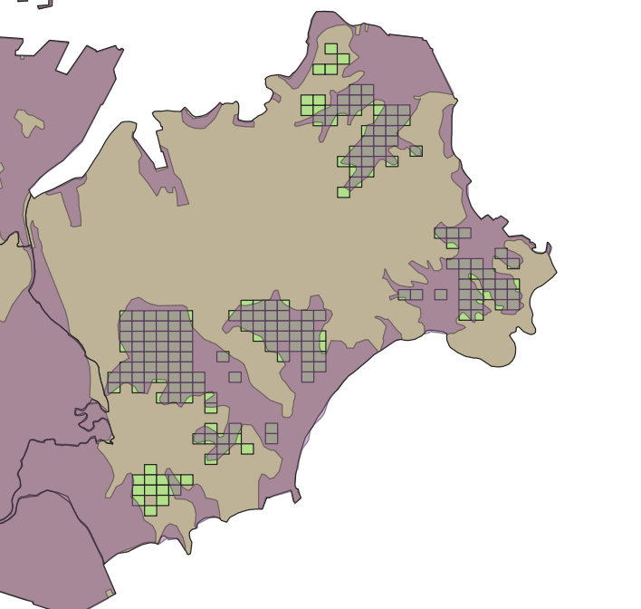

##  {.section-slide}

::: section-heading
イントロダクション
:::

## はじめに

- 東日本大震災から15年が経った
- 2020年代に入ってから津波被災地における農業復興関連の研究は非常に少なくなっている
- しかし、復興プロセスにおける経営体の意思決定メカニズムや復興政策の効果を検証する研究は乏しい

## 津波被災地における農業復興関連の既存研究

- 全体的に事例研究が多い(@XiaoShanTianDongRiBenDaZhenZaiJinBoBeiHaikaranoNongYeFuXingniGuansuruYanJiuDongXiang2016)

- 被災地全体の状況を扱った研究は、@xiǎoyě2019,@XiaoYeDongRiBenDaZhenZaiJinBoBeiZaiDiYuniokeruShuiTianNongYeFuXingnoXianZhuangNongYeGouZaoBianHuatoZuZhiJingYingTinoZhuTeZheng2020 が代表的

- 経営体の意思決定メカニズムに関する研究は少ない

- 復興政策の効果を検証する研究はみられない

## 災害と農業復興関連の既存研究

- @GuanShanDaGuiMoZiRanZaiHainoBeiZaiDiniokeruNongYeGuanLianBuZhuShiYenoHuoYongtoYingNongnoChangQiDeBianRong2021

- 復興政策の影響や、復興主体の異質性に焦点を当てた研究が見られる

## 本研究の目的

- 宮城県S町を事例に、復興政策に対して各農業経営体が異なる反応を示した要因と、組織的担い手と個別経営体への農地集積が併存するに至った過程を明らかにする。

- また、主に農林業センサスを用いて、S町で見られた現象の一般化可能性を探る。

##  {.section-slide}

::: section-heading
宮城県S町における\
農業復興プロセス
:::

## 津波被災と農業復興政策の概要

- 多くの農地が浸水。

- 代表的な復興交付金事業

  - C-1事業

  - C-4事業

- とくに宮城県では両事業を通して効率的な農業への再編が目指されていた

## 宮城県S町における農業復興

## S町の圃場浸水状況



::: note-small
**注：** 圃場位置は国土数値情報の2009年土地利用データを2次メッシュで表示。\
津波浸水範囲は国土地理院「平成23年（2011年）東日本大震災2.5万分1浸水範囲概況図（宮城県版）」による。
:::

## QCAによる営農意向要因分析

```{r}
#| include: false
# スライドには掲載しない

library(tidyverse)
library(QCA)
df_qca <- read_csv("02_processed_data/shichigahama_qca.csv")

vars <- c("name", "indint", "successor", "mechcap", "agecap")

# 各変数の欠損数
colSums(is.na(df_qca[vars]))

# 分析に使用できるケース
df_qca_complete <- df_qca[complete.cases(df_qca[vars]), vars]

tt <- truthTable(
  df_qca_complete,
  outcome = "indint",
  conditions = c("successor", "mechcap", "agecap"),
  incl.cut = 0.80,
  n.cut = 1,
  show.cases = TRUE,
  complete = TRUE
)

sol_complex <- minimize(
  tt,
  details = TRUE,
  show.cases = TRUE
)

sol_complex


```

##  {.section-slide}

::: section-heading
S町の事例の一般化可能性\
― センサスによる検討 ―
:::

## aaa

（内容）

##  {.section-slide}

::: section-heading
おわりに
:::

## aaa

（内容）

## 参考文献
